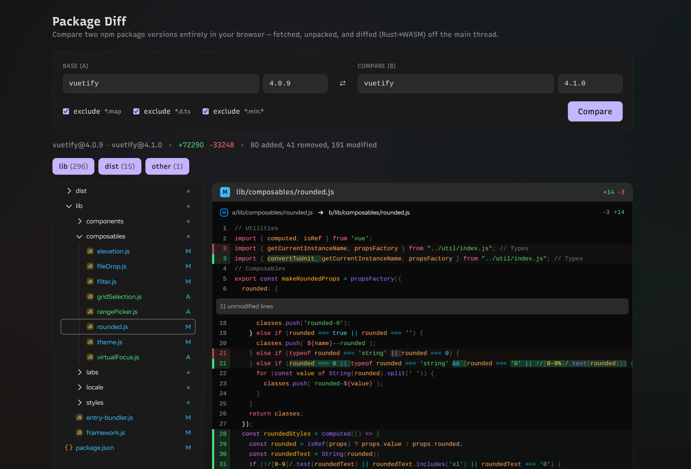

# pkg-diff

Diff two npm package versions **entirely in the browser** — no server, no
backend. Tarballs are fetched straight from the npm registry, unpacked, and
diffed client-side, with the line-diffing done by a **Rust → WebAssembly**
module. The whole app is a static site you can drop on any host.

**[pkg-diff.vuetifyjs.com](https://pkg-diff.vuetifyjs.com/)**



## Alternatives

- [npmdiff.dev](https://npmdiff.dev/) – SSR, slow at times, no cross-package diffs, unknown source
  (but handles very large files with no limit, which is a big advantage)
- [MUI diff-package](https://frontend-public.mui.com/diff-package) – slow, crashes easily
- [`npm diff`](https://docs.npmjs.com/cli/v9/commands/npm-diff) – CLI only, no HTML output, no filters
- other CLI tools – unmaintained, cumbersome to use

## CLI (for agents)

Example prompt:

```
use `pnpm diff vuetify@3.12.11 latest` command and drill a bit deeper to give me high-level overview
of the effective changes. I am only interested in things affecting my app based on Vuetify framework
```

`cli/pkg-diff.ts` runs the same pipeline headless on Node.js (requires v24.x) — no build step needed.
The default call is a quick summary (files & stats). Patches are pulled per file and paged. Includes caching.

```bash
pnpm diff --help
pnpm diff vuetify@4.0.9 4.1.0 # summary
pnpm diff vuetify@4.0.9 4.1.0 --filter 'lib/components/VTreeview/**' # narrow the summary
pnpm diff vuetify@4.0.9 4.1.0 --file package.json # display actual file diff
pnpm diff vuetify@4.0.9 4.1.0 --file 'lib/**/*.js' --file 'lib/**/*.{scss,sass}'
npm link # install global command
pkg-diff --help
```

Two deliberate differences from the web UI: `*.d.ts` is **kept** (it's the
cheapest signal for API changes) and `*.min.*` is excluded.

### Caveats

- code order in Vuetify's `dist/*.css` bundle files is not deterministic between builds
   - pass `--exclude 'dist/*.css'` to drop that noise, and look at `lib/**/*.(sass|scss)` instead
- declaration order in Vuetify's `*.d.ts` and `dist/json/*.json` files is not deterministic either
   - prefer `lib/**/*.js` files instead until the issue is resolved

### vs GitHub compare

You might reasonable think that since direct NPM assets diff is full of noise, agents time would be better spent with source code diffs. While it would work for Vuetify most of the time, there are some major limitations.

```bash
gh api repos/vuetifyjs/vuetify/compare/v4.0.8...v4.0.9 -H "Accept: application/vnd.github.diff"
```

- files list caps at 300, while `patch` is dropped for large files, and very large version ranges are rejected
- might include unrelated tweaks to the documentation, while hiding effective changes that affects framework API
- cross-package comparisons are not possible (e.g. `vuetify` vs `@vuetify/nightly` to get pre-release sneak peak)
- needs a GitHub repo with matching release tags. Expecting it from every NPM package is not realistic.
- rate-limited without a token

## Develop

```bash
pnpm install
pnpm dev
```

## Build

```bash
pnpm build      # type-check + vite build → dist/ (static website)
pnpm preview    # serve dist/ locally
pnpm test       # for the CLI's arg parsing and paging
```

## Credits

Diff rendering is powered by [`@pierre/trees`](https://diffs.com) (file tree
sidebar) and [`@pierre/diffs`](https://diffs.com) (diff content pane).
